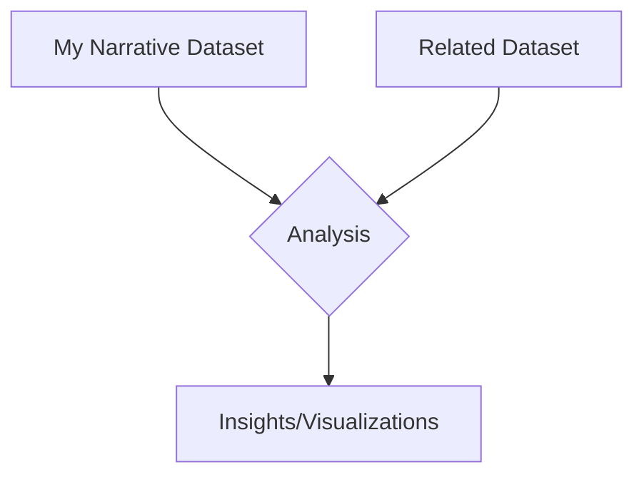

# Geoprocessing Assignment Guide

## Overview
This guide will help you create a GeoJSON dataset that tells a story about your experience in a city, along with a related dataset and workflow for analysis.

## Step 1: Create Your Narrative Dataset

### Choose Your Narrative
Select a personal experience that can be represented geographically, such as:
- Your daily commute
- Favorite places in your neighborhood
- A memorable trip or journey
- Locations of personal significance

### Data Collection
1. **Choose Your Data Type**:
   - **Points**: Specific locations (e.g., coffee shops, parks, landmarks)
   - **Lines**: Routes or paths (e.g., commute routes, running paths)
   - **Polygons**: Areas (e.g., neighborhoods, parks, zones of activity)

2. **Data Collection Tools**:
   - **geojson.io**: Simple web-based tool for creating GeoJSON
   - **QGIS**: More advanced desktop GIS software
   - **Google My Maps**: Export as KML and convert to GeoJSON

## Step 2: Create Your GeoJSON File

### Using geojson.io
1. Go to [geojson.io](https://geojson.io/)
2. Use the drawing tools (point, line, polygon) to create your features
3. Add properties to each feature (name, description, etc.)
4. Save as GeoJSON (.geojson)

### Example GeoJSON Structure
```json
{
  "type": "FeatureCollection",
  "features": [
    {
      "type": "Feature",
      "properties": {
        "name": "Favorite Coffee Shop",
        "type": "cafe",
        "visit_frequency": "daily"
      },
      "geometry": {
        "type": "Point",
        "coordinates": [-73.989, 40.733]
      }
    }
  ]
}
```

## Step 3: Identify a Related Dataset

### Possible Related Datasets
- **Transportation**: Subway/bus routes, bike lanes
- **Points of Interest**: Parks, restaurants, cultural sites
- **Demographic Data**: Population density, income levels
- **Environmental Data**: Green spaces, pollution levels

### Sources for Related Data
- [NYC OpenData](https://opendata.cityofnewyork.us/)
- [OpenStreetMap](https://www.openstreetmap.org/)
- [US Census Bureau](https://www.census.gov/)
- [Natural Earth Data](https://www.naturalearthdata.com/)

## Step 4: Workflow Diagram

Create a diagram showing how your datasets relate. Example:



### Example Analysis Ideas
- **Proximity Analysis**: How close are your points to certain features?
- **Density Analysis**: Are your points clustered in certain areas?
- **Temporal Analysis**: How do patterns change over time?

## Step 5: Documentation

Create a markdown document (`README.md`) with:
1. **Dataset Descriptions**: What each dataset represents
2. **Data Sources**: Where the data came from
3. **Methodology**: How you processed/analyzed the data
4. **Findings**: What you discovered
5. **Visualizations**: Maps or charts showing your analysis

## Submission Requirements
1. Your GeoJSON file
2. A Jupyter notebook with your analysis
3. A markdown document with your documentation
4. Any additional files (images, data, etc.)

## Example Jupyter Notebook Structure

```python
# 1. Import Libraries
import geopandas as gpd
import matplotlib.pyplot as plt

# 2. Load Your Dataset
narrative_data = gpd.read_file('my_narrative.geojson')
related_data = gpd.read_file('related_data.geojson')

# 3. Explore the Data
print(narrative_data.head())
print(related_data.head())

# 4. Perform Analysis
# (Example: Spatial join, buffer analysis, etc.)

# 5. Create Visualizations
fig, ax = plt.subplots(figsize=(10, 10))
narrative_data.plot(ax=ax, color='red')
related_data.plot(ax=ax, color='blue', alpha=0.5)
plt.title('My Narrative Data vs Related Data')
plt.show()
```

## Tips for Success
- Start small - focus on a clear, simple narrative
- Document your process as you go
- Make sure your GeoJSON is properly formatted
- Test your analysis with small subsets of data first
- Create clear visualizations to tell your story
